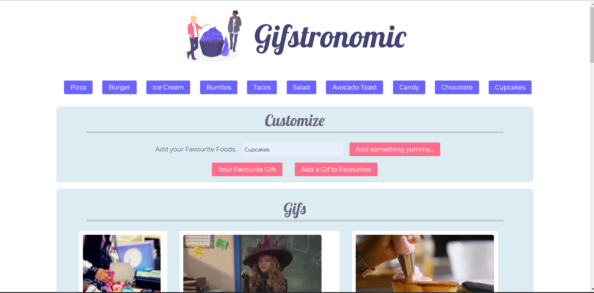
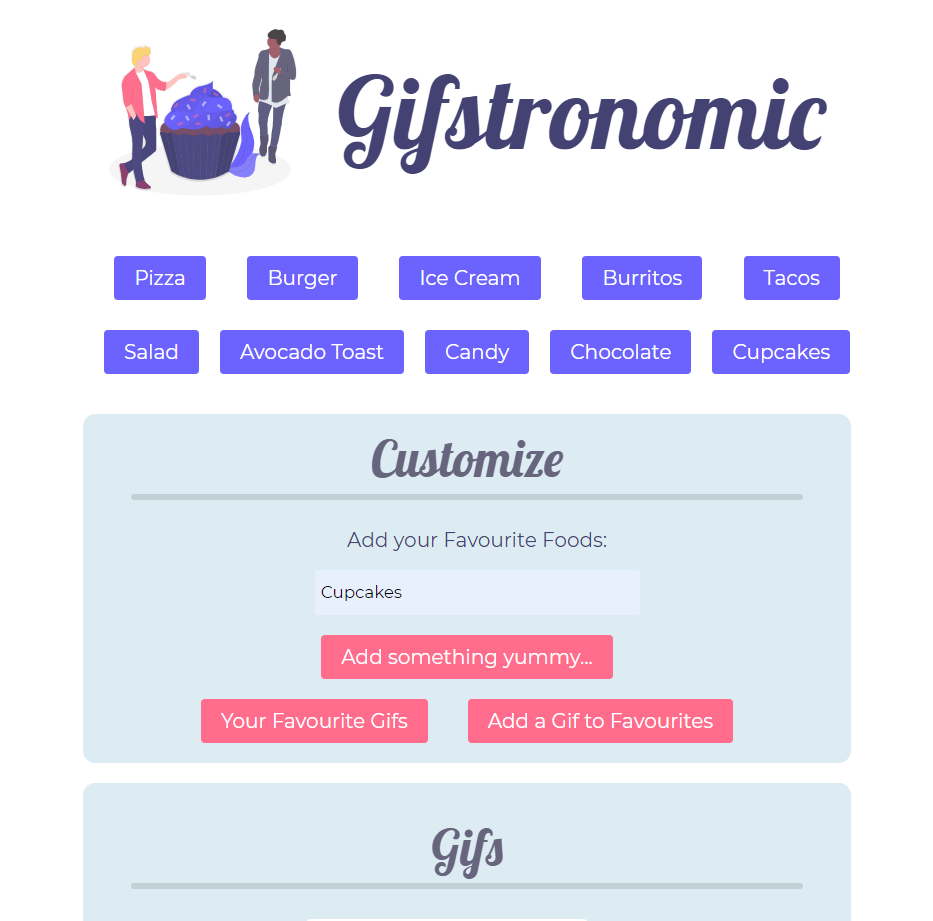

# Gifstronomic
A simple app that uses the Giphy API to find gifs based on search terms.

## Author
Madeleine Griggs.

## About this Project
this is an app for retriving gifs from the Giphy API, and displaying them. There are several buttons with food themed words, and the user can click on one of them to search for that word through Giphy, and then displaying 10 gifs from that category.

The user can also add new buttons, so they can search for other gifs. They may also save gifs that they like, and check them out in the "favorite gifs" section. This section persists by using local storage to store the favourited gifs.

This project was written using: HTML5, CSS3, jQuery 3.4.1, and Javascript. It also uses the Giphy API.
You can use this app here:

[Gifstronomic](https://typicu.github.io/Gifstronomic/)

## Information about the Theme

### Colors Used
-  `#444273 - Dark Blueberry: Dark blue color used for title font.`
-  `#6C63FE - Bright Blueberry: Used for all food buttons.`
-  `#ddecf2 - Light Grey: Very light grey used for backgrounds of main content areas.`
-  `#c3d0d6 - Slightly Darker Grey: Slightly darker than light grey, used for hr tags only.`
-  `#67657D - Mid Grey: Main font color.`
-  `#FF6C8C - Accent Salmon: Used for buttons in the customization area.`

### Fonts Used
- Font Family: 'Lobster', cursive. Used for Titles.
- Font Family: 'Montserrat', sans-serif. Main font.

### Screenshots

#### Title Page

